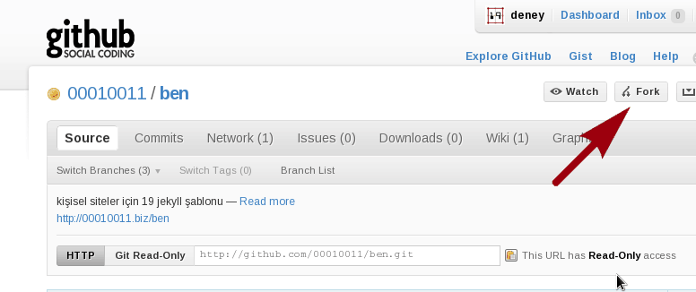

# Kişisel Sayfalar İçin 19 Jekyll Şablonu

TODO

## Başlarken

1. Başlamadan önce lütfen aşağıdaki dokümanları okuyun:

    - Bu depoda kullanılan konvansiyonlar için

    - Jekyll'ı tanımak için

    - Site hazırlarken izlemeniz gereken ilkeler için

2. Depoyu "fork"layın.

   

3. Deponun size ait bir Git deposu olması için

            git remote add upstream git://github.com/00010011/ben.git

4. `_config.yml`'yi düzenleyin ("`«»`" karakterleriyle belirtilen alanları
   düzenlemeyi özellikle unutmayın).

5. GitHub'a girerek henüz oluşturmamışsanız, GitHub ön sayfalarınızı
   barındıracak `<kullanıcı>.github.com` isimli depoyu oluşturun.  Örneğin
   GitHub hesap adınız (`_config.yml` dosyasında `param` → `account`
   değişkeni) `roktas` ise deponun adı `roktas.github.com` olmalıdır.

## Ne Nedir?

Depodaki dosya/dizinler ve işlevleri şunlardır:

- `_config.yml`: Jekyll yapılandırma dosyası (YAML formatında).  Deponun pek
  çok özelliğini sadece bu dosyayı düzenleyerek değiştirebilirsiniz.

- `index.html`: Web sitesinin kök adresinde görüntülenecek dosya.

- `0`, `1`, `2`, `7` ve `9`: Bu bölüm dizinleri ilgili ilke belgesinde
  dokümante edilmiştir.

- `_layouts`: Depoya ekleyeceğiniz girdilerden HTML çıktı üretmekte
  kullanılacak olan Jekyll şablonları.  Ayrıntılı bilgi için lütfen [Jekyll
  NASIL](belgesini) okuyun.

- `_includes`: Şablonlarda kullanılan "işlev" parçaları.  Bu şablon depoda
  bulunan işlevler, özelleştirilmesi zor büyük dosyalar yerine, parçalı halde
  bu dizindeki dosyalara dağıtılmıştır.  Yapacağınız özelleştirmelerde ilgili
  parçaları `include` ederek o özellikten yararlanabilirsiniz.

- `assets`: Depo özelleştirmesinde, içeriklerde kullanacağınız "sayısal
  varlık"ların (ör. görseller, resimler, CSS dosyaları, JavaScript betikleri)
  tutulacağı dizin.

- `atom.xml`: Depodan üretilen sitenin kök dizininde yayın yapacak "Atom" özet
  akışı tanımı.

- `404.html`: Web siteniz GitHub'da yayımlanıyorsa, bulunamayan dosyalar için
  üretilen `404` hataları bu sayfaya yönlendirilecektir.  (Not: GitHub'ın
  `404` yönlendirme özelliği geçici olarak kaldırılmıştır.)

## Test

Siteyi test etmek için depo kökünde bulunan `j` betiğini kullanabilirsiniz:

	./j
